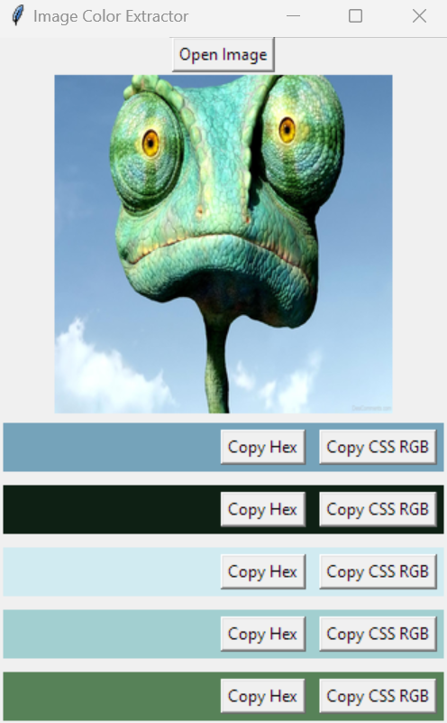

# Image Color Extractor

## Overview
Image Color Extractor is a Python-based application that allows users to extract the five most dominant colors from an image. It displays these colors along with their Hex and CSS RGB values, which can be easily copied to the clipboard.

## Features
- Open any image to analyze.
- Extract and display the five primary colors from the image.
- Copy Hex and CSS RGB values of each color with dedicated buttons.

## Installation
To run this application, you need Python installed on your system along with several libraries including Pillow, Numpy, scikit-learn, and pyperclip. You can install these dependencies using pip:

```bash
pip install Pillow numpy scikit-learn pyperclip
```

## Usage
Run the application.
```bash
python app.py
```
Click on 'Open Image' to load an image file.
View the extracted colors displayed below the image.
Use 'Copy Hex' or 'Copy CSS RGB' buttons to copy color values.

## Screenshot


## License
[](https://opensource.org/licenses/MIT)

## Contributing
Pull requests are welcome. For major changes, please open an issue first to discuss what you would like to change.